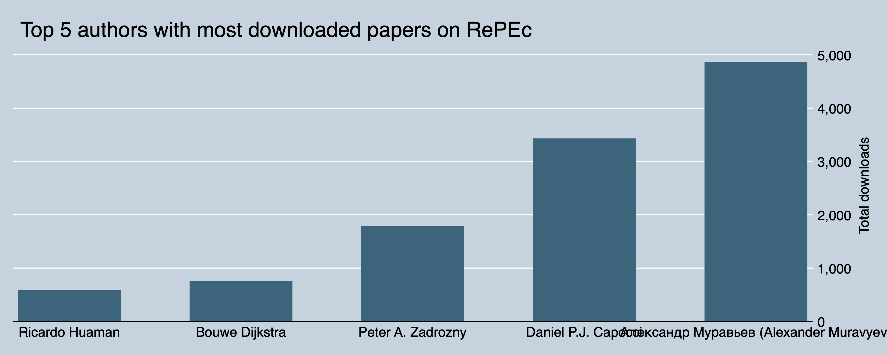
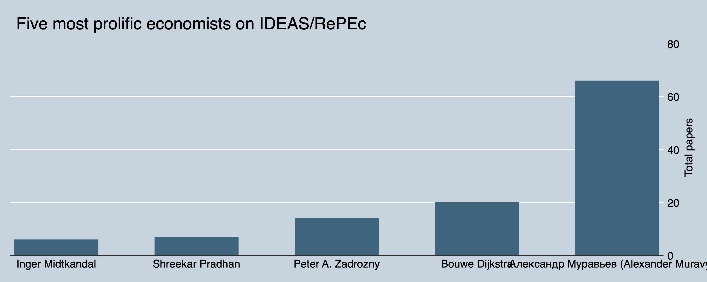

# About ✌🏽

Hello world 🌏! Are you an economist, or economics student, or just a random person like me who is interested in economics? Have you looked at IDEAS/RePEc statistics website? Do you wonder that you could grab them all without any hassle? Yes, right, you can get it here how! 😃

TL;DR: If you don't want to run this locally, you can just go straight to the data so you can just chill and relax. Grab them for [<strong>journal articles</strong>](https://raw.githubusercontent.com/ledwindra/ideas-repec/master/data/journal-article.zip) and [<strong>working papers</strong>](https://raw.githubusercontent.com/ledwindra/ideas-repec/master/data/working-paper.zip). 🌞 ⛱ 🥥 🌴 😎

# Use case

We can make a simple analysis regarding which papers are most popular on RePEc. The metrics can be total downloads. For example, see the Stata graph below (the program is inside the [<strong>do directory</strong>](https://github.com/ledwindra/ideas-repec/blob/master/do/ideas_repec.do)):



The command is as follows:

```
graph bar (sum) file_downloads_total, ///
	over(author, sort(1)) ///
	ysize(8) ///
	xsize(20) /// 
	scheme(economist) ///
	title("Top 5 authors with most downloaded papers on RePEc") ///
	ytitle("Total downloads")

graph export ./img/author-most-downloaded.png, replace
```

or this:



# Do it yourself

If instead you want to do this locally, you can just proceed the following steps. 🤞🏽

# Clone

If you think this is going to be useful for your purpose, don't hesitate to clone this repository:

```bash
git clone https://github.com/ledwindra/ideas-repec.git
cd ideas-repec
```

To get the latest updates, run `git pull origin master`

# Permission

You can check its [robots.txt](https://logec.repec.org/robots.txt). It doesn't explicitly disallow any user to get this specific area that we would like to scrape.

```
User-agent: *
Disallow: /scripts/
```

# Virtual environment and install dependencies

Use virtual environment if you don't want to mess around with the existing modules installed on your machine. Just run the following on terminal:

```bash
python -m venv .venv
source .venv/bin/activate
pip install --upgrade pip
pip install -r requirements.txt
```

To exit from virtual environment, type and press `deactivate`. 🌞 🌆

# Run

Take a look at the program and its help guide that consists of arguments and their descriptions.

```bash
python src/ideas_repec.py --help

usage: ideas_repec.py [-h] [-a] [-t] [-s] [-u] [-i] [-c] [-v] [-f]

optional arguments:
  -h, --help          show this help message and exit
  -a , --author       How many author(s) will be scraped (default is 10)
  -t , --timeout      How long for each request before it timed out in seconds
                      (default is 5)
  -s , --sleep        How long to make time interval between iterations in
                      case exception occurs in seconds (default is 1)
  -u , --user_agent   User agent used for headers (default is user-agent)
  -i , --index        Table index. 0 = working papers; 1 = journal articles
                      (default is 0)
  -c , --column       Total column name (default is working_paper)
  -v , --value        Total column value (default is Total Working Papers)
  -f , --file_name    Ouput file path (default is ./data/working-paper.zip)
```

# Columns

Below is the description of each data and column. They're all fortunately self-explanatory.

### [Working papers](https://github.com/ledwindra/ideas-repec/blob/main/data/working-paper.zip?raw=true):

|column_name|description|
|-|-|
|author|Author name|
|id|Author ID (which is derived from RePEc URL)|
|working_paper|Working paper title|
|file_downloads_last_month|Total downloads in the past month as of current date|
|file_downloads_3_months|Total downloads in the past quarter as of current date|
|file_downloads_12_months|Total downloads in the past year as of current date|
|file_downloads_total|Total downloads in total as of current date|
|abstract_views_last_month|Total abstract views in the past month as of current date|
|abstract_views_3_months|Total abstract views in the past quarter as of current date|
|abstract_views_12_months|Total abstract views in the past year as of current date|
|abstract_views_total|Total abstract views as of current date|

### [Journal articles](https://github.com/ledwindra/ideas-repec/blob/main/data/journal-article.zip?raw=true):

|column_name|description|
|-|-|
|author|Author name|
|id|Author ID (which is derived from RePEc URL)|
|journal_article|Journal article title|
|file_downloads_last_month|Total downloads in the past month as of current date|
|file_downloads_3_months|Total downloads in the past quarter as of current date|
|file_downloads_12_months|Total downloads in the past year as of current date|
|file_downloads_total|Total downloads in total as of current date|
|abstract_views_last_month|Total abstract views in the past month as of current date|
|abstract_views_3_months|Total abstract views in the past quarter as of current date|
|abstract_views_12_months|Total abstract views in the past year as of current date|
|abstract_views_total|Total abstract views as of current date|

# Contribute

If you happen to find bugs or issues when running the script, don't hesitate to submit the issues [<strong>`here`</strong>](https://github.com/ledwindra/ideas-repec/issues). If you'd like to contribute, here's what you can do:

1. Clone the repo
2. Create new branch by running `git checkout -b [YOUR-BRANCH-NAME]`
3. Always pull from `master` before push
4. Make `pull request`

The other way would be just contact me personally. I'm just a regular person.

# Closing

If you have read up to this line, thank you for bearing with me. Hope this is useful for your purpose! 😎 🍻
